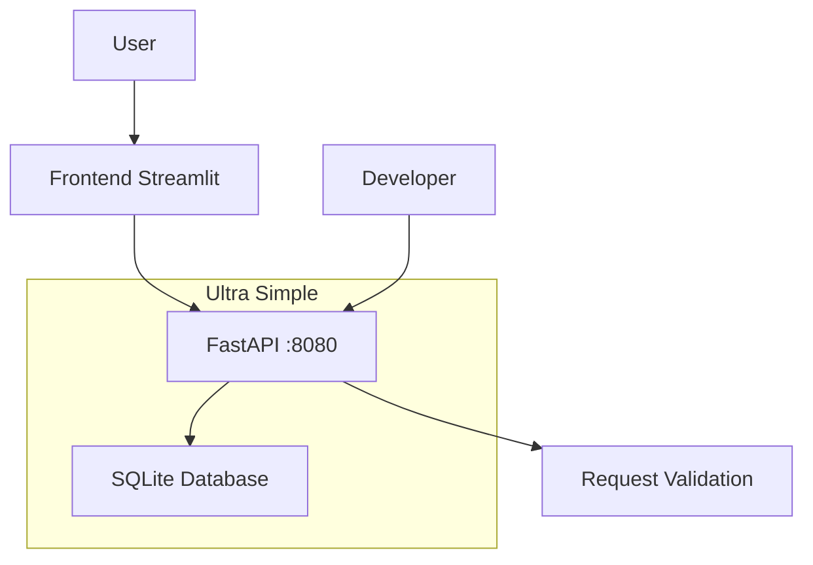

# 🎭 kd-Role

> **🎯 Objetivo**: Buscar eventos de forma simples, rápida e eficiente.

## ⚡ Start

```bash

# 🚀 INICIAR TUDO (RECOMENDADO)
./start_all.sh

# 🛑 PARAR TUDO & LIMPAR
./stop_all.sh

# ⚙️ MANUAL (se necessário)
podman-compose up --build -d
streamlit run frontend.py --server.port 8501 --server.headless true &
```

## 🌐 URLs

- **API**: http://localhost:8080
- **Docs**: http://localhost:8080/docs  
- **Frontend**: http://localhost:8501

## 🎯 API Endpoints

```
GET  /           → Status da API
GET  /eventos    → Listar eventos
GET  /cidades    → Listar cidades
POST /eventos    → Criar evento

```

## 📦 Arquitetura



## 🎭 Uso

```bash
# Adicionar evento
curl -X POST http://localhost:8080/eventos \\
  -H "Content-Type: application/json" \\
  -d '{"nome":"Meu Evento","cidade":"São Paulo","data":"2025-01-25"}'

# Buscar eventos
curl http://localhost:8080/eventos

# Filtrar por cidade  
curl http://localhost:8080/eventos?cidade=São%20Paulo
```

## 🧹 Princípios Kiss

- ✅ **Simplicidade**: 1 arquivo
- ✅ **Direto**: Zero configuração  
- ✅ **Foco**: Só buscar eventos
- ✅ **Leve**: SQLite, sem complexidade

## 📂 Estrutura

```
kd-role/
├── eventos.py           # FastAPI 
├── frontend.py          # Streamlit UI  
├── docker-compose.yml   # Único container
└── README.md           # Esta documentação
```

---

## 🚀 Controle Completo

| **Ação** | **Comando** | **Função** |
|----------|-------------|------------|
| 🟢 **Iniciar** | `./start_all.sh` | Inicia API + Frontend + Cleanup |
| 🔴 **Parar** | `./stop_all.sh` | Para tudo + libera portas + limpeza |
| 📊 **Status** | `curl localhost:8080` | Verifica se API está funcionando |

---

