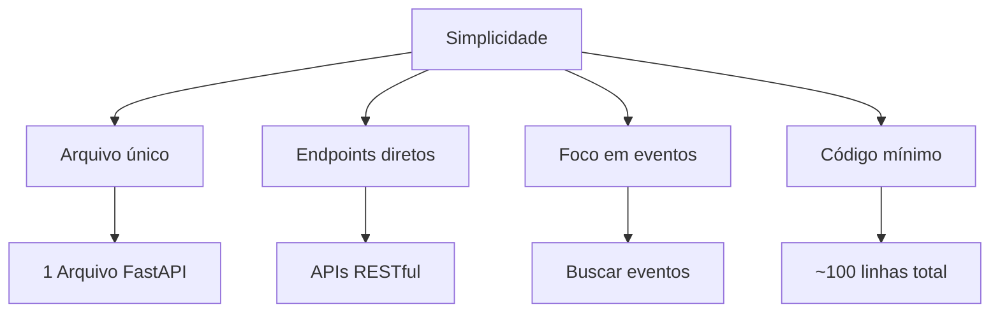
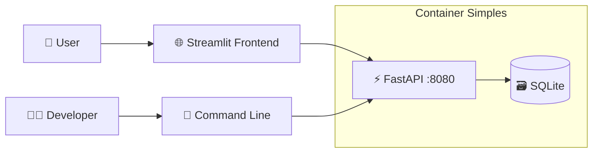
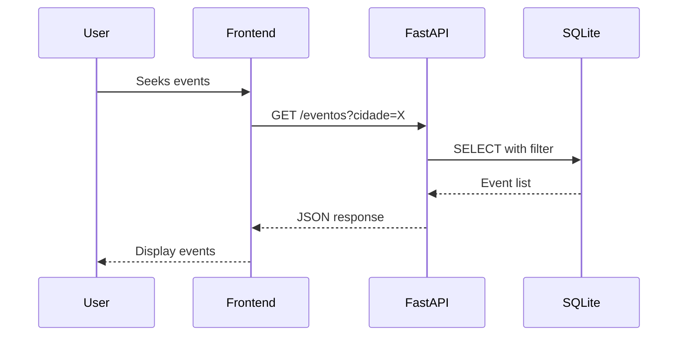
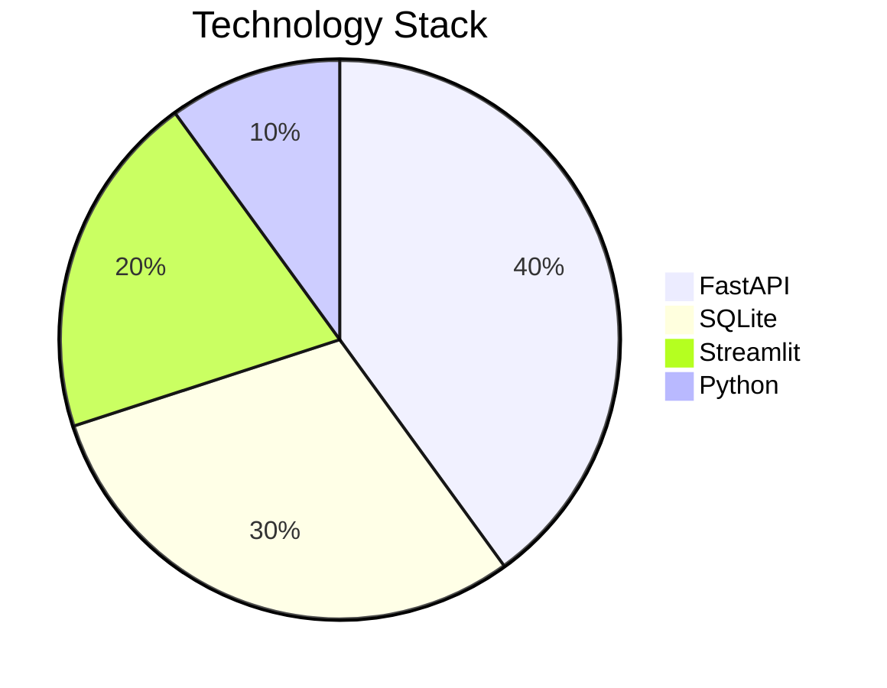
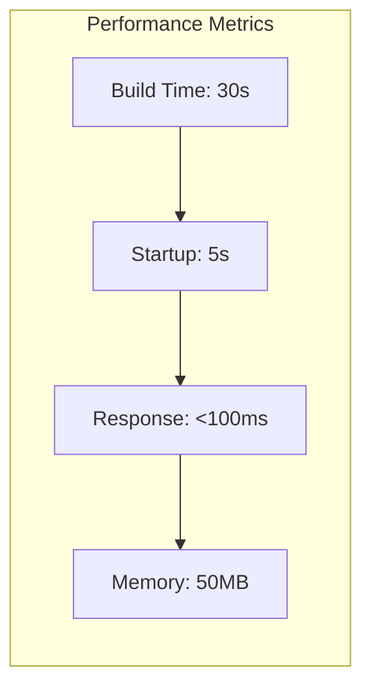
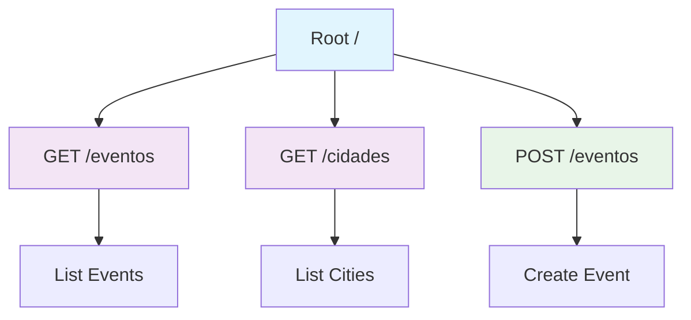
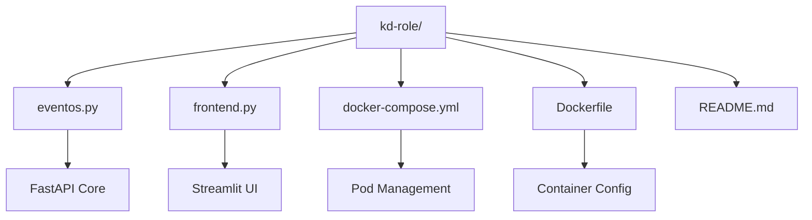

# 🏗️ Arquitetura kd-Role

## 📋 Visão Geral

kd-Role é uma aplicação simples para buscar eventos com o mínimo de complexidade possível.

## 🎯 Princípios

## 🌐 Arquitetura de Rede

## 📦 Fluxo de Dados

## 🔧 Stack Tecnologico

## 📊 Performance

## 🎭 Endpoints

## 📂 Estrutura Simplificada

---

**🎯 Objetivo**: Arquitetura minimalista que funciona perfeitamente para buscar eventos.
